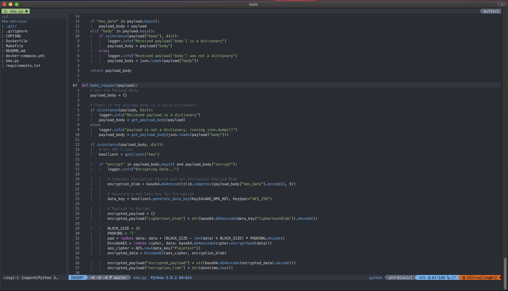
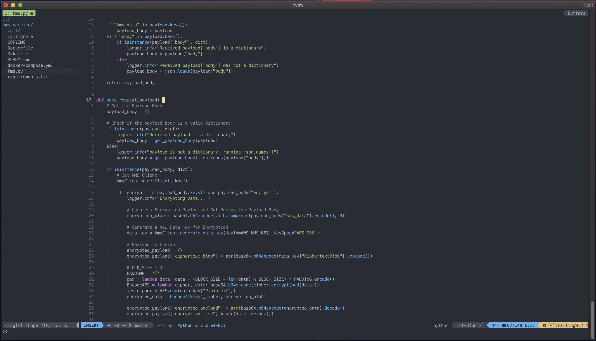
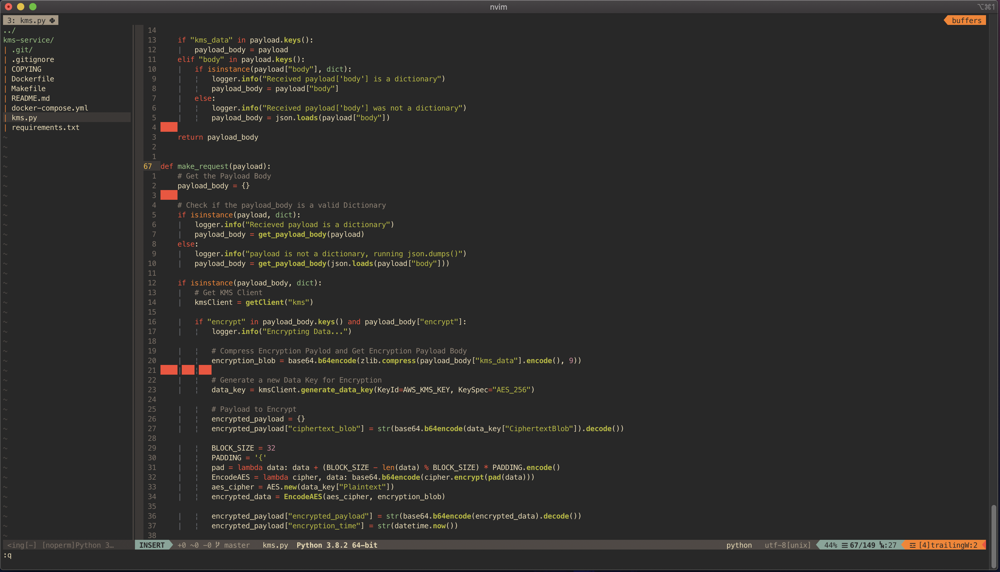
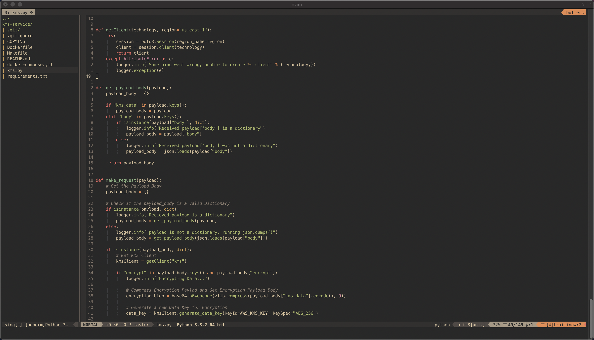

# nVim Config
Its only been a couple weeks that I decided to switch my editor to vim and try to use it as my default editor. Here is my setup, currently this works for me and I hope this help you out.

This nVim config should allow for a easy transition to vim from other editors. This is setup to be an editor while working with Terraform, Docker, Python and GoLang and should be easy to extend to whatever your use case is.

## Pre-Requisite
* [Neovim](https://neovim.io/) (0.4 or higher)
* [Terraform](https://www.terraform.io/) (Optional: Depending on use)
* [Terraform Language Server](https://github.com/hashicorp/terraform-ls) (Optional: Depending on terraform use)
* [Python 3](https://www.python.org/) (Optional: Depending on use)
* [Docker](https://www.docker.com/) (Optional: Depending on use)
* [GoLang](https://golang.org/) (For [vim-go](https://github.com/fatih/vim-go))
* [NodeJS](https://nodejs.org/en/) and [Yarn](https://formulae.brew.sh/formula/yarn) (For [CoC.vim](https://github.com/neoclide/coc.nvim))
* [FzF](https://formulae.brew.sh/formula/fzf) (Required: You will want to install FzF)
* [Ripgrep](https://formulae.brew.sh/formula/ripgrep) (Required: You will want to install Ripgrep)
* [Nerd Font](https://github.com/ryanoasis/nerd-fonts) (Fonts for Statusline)

## Usage
Make sure you copy the `init.vim` and `coc-settings.json` file to your nvim config folder. For me on MacOS it was `~/.config/nvim/`.

Once the files are copied you will want to install the Plugin Manager, I am using [vim-plug](https://github.com/junegunn/vim-plug). Make sure you have that installed correctly. Instruction for that can be found [here](https://github.com/junegunn/vim-plug).

You will also want to install [FzF](https://formulae.brew.sh/formula/fzf), [Ripgrep](https://formulae.brew.sh/formula/ripgrep) and [Nerd Font](https://github.com/ryanoasis/nerd-fonts).

Once `vim-plug` is installed, create a directory at the following path `~/.local/share/nvim/plugged`.

You will also want to create the following directory for `Undotree` plugin `~/.local/share/nvim/undodir`.

Run `nvim +PlugInstall` to install all of the Plugins.

**(Optional)** If you are working with GoLang, you will want to make sure you have your `$GOPATH` and `$GOBIN` setup and run `nvim +GoInstallBinaries`

**(Optional)** If you are using `Python` you can run the following command in nVim to enable python intellisense using CoC.nvim.
> :CocInstall coc-json coc-python coc-marketplace

## Shortcuts / Remaps List
**`<leader>`** : Space Bar

### *Within Netrw Buffer*
- **`V`** : Open the file in a new Vertical Split
- **`H`** : Open the selected file in a Horizontal Split
- **`<leader>` + `pv`** : Toggle Netrw

### *Regular Buffer*
- **`<leader>` + `** : Open a terminal buffer
- **`<leader>` + `et`** : Exit the terminal buffer
- **`<leader>` + `pf`** : Open File drawer using FzF

### *Window Management*
- **`<leader>` + `h`** : Focus the buffer window to the right
- **`<leader>` + `k`** : Focus the buffer window to the top
- **`<leader>` + `j`** : Focus the buffer window below 
- **`<leader>` + `l`** : Focus the buffer window to the right
- **`<leader>` + `+`** : Resize the vertical window +5
- **`<leader>` + `=`** : Resize the vertical window -5
- **`<leader>` + `-`** : Resize the horizontal window +5
- **`<leader>` + `_`** : Resize the horizontal window -5
- **`<leader>` + `cv`** : Create a new vertical split
- **`<leader>` + `ch`** : Create a new horizontal split
- **`<leader>` + `al`** : Move the buffer vertically to right
- **`<leader>` + `aj`** : Move the buffer horizontally below

### *Tab Management*
- **`<leader>` + `tn`** : Create a new tab
- **`<leader>` + `tk`** : Go to the next tab
- **`<leader>` + `tj`** : Go to the previous tab
- **`<leader>` + `th`** : Go to the first tab
- **`<leader>` + `tl`** : Go to the last tab

### *Editing*
- **`<tab>`** : Go to the next word
- **`<shift>` + `<tab>`** : Go to the previous tab
- **`O`** : Insert a new line above

### *Undotree*
- **`<leader>` + `u`** : Open undo tree

### *Quick Edit Vim Config*
- **`<leader>` + `ep`** : Open the vim config file for quick edits

### *Conquer of Completion (CoC)*
- **`<tab>`** : Go to next suggestion
- **`<shift>` + `<tab>`** : Go to the previous suggestion
- **`<enter>`** : Accept the current suggestion
- **`gd`** : coc-definition
- **`gy`** : coc-type-definition
- **`gi`** : coc-implementation
- **`gr`** : coc-references
- **`<leader>` + `rn`** : coc-rename
- **`<leader>` + `f`** : coc-format-selected

## iTerm2 Themes to match Vim
- [One Half](https://github.com/sonph/onehalf)
- [One Dark](https://github.com/joshdick/onedark.vim/blob/master/term/One%20Dark.itermcolors)
- [Gruvbox](https://github.com/herrbischoff/iterm2-gruvbox)
- [Gruvbox Material](https://github.com/AmmarCodes/gruvbox-material-iterm2) (For other terminals [here](https://github.com/sainnhe/gruvbox-material/wiki/Related-Projects))

---
## Screenshots
### One Half Theme

  

### OneDark Theme

  

### Gruvbox Theme

  

### Gruvbox Material Theme

  

## Have Fun!
If you have any questions feel free to reach out.

